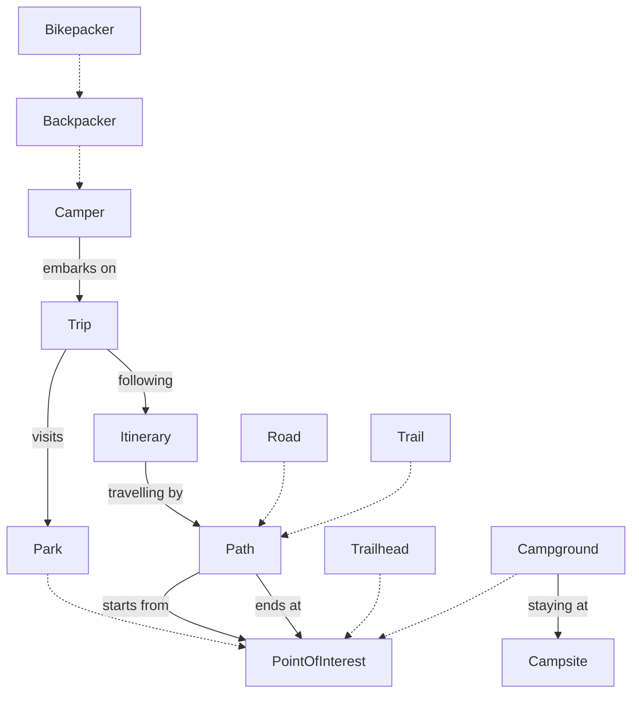

A camper can be a backpacker, who could be a bikepacker.
The camper embarks on a trip, which follows an itinerary.
The trip is visiting a park, which the camper will travel by path, which road and trail are both instances of.
The camper travels to a point of interest and ends at a point of interest via a path.
Points of interest include trailheads, lakes, vistas, waterfalls, campgrounds, and other parks
The camper stays at a campsite within a campground, which is within a park.

